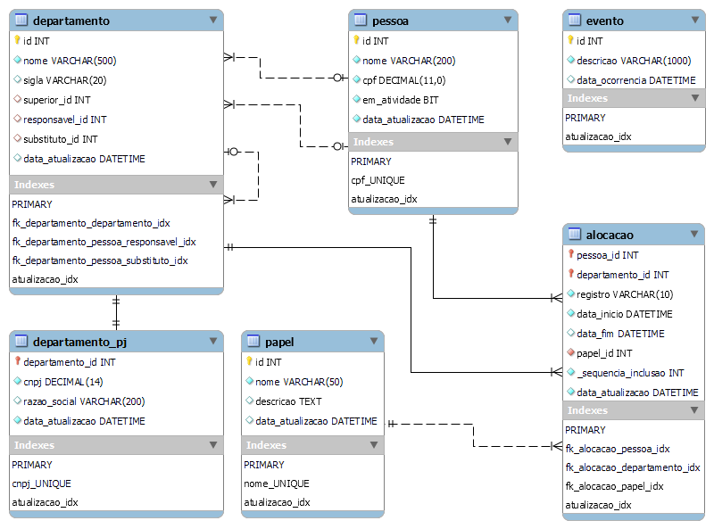

# 👩‍💼👨‍💼 organizacao-db

Recursos referentes a bancos de dados de uma organização, para fins de testes de cenários.

Implementações em MySQL e Microsoft SQL Server.

## _Scripts_

- MySQL
  - [DDL (somente estrutura)](scripts/mysql/mysql-organizacao-DDL.sql)
  - [DML (somente dados)](scripts/mysql/mysql-organizacao-DML.sql)
  - [Ambos (estrutura e dados)](scripts/mysql/mysql-organizacao-DDL-DML.sql)
- SQL Server
  - [DDL (somente estrutura)](scripts/sqlserver/sqlserver-organizacao-DDL.sql)
  - [DML (somente dados)](scripts/sqlserver/sqlserver-organizacao-DML.sql)
  - [Ambos (estrutura e dados)](scripts/sqlserver/sqlserver-organizacao-DDL-DML.sql)

## Modelo de dados

Arquivo do MySQL Workbench: [`model/organizacao.mwb`](model/organizacao.mwb)

**Diagrama Entidade-Relacionamento**



## Rodando com Docker

1. Baixe esse repositório, e acesse o seu conteúdo:

```bash
git clone https://github.com/ermogenes/organizacao-db
cd organizacao-db
```

2. Execute o comando de uma das versões abaixo:

  - _MySQL_: `docker compose up mysql`
  - _SQL Server_: `docker compose up sqlserver`
  - _Ambos_: `docker compose up`

### Credenciais:

Serviço | Endereço | Usuário | Senha
--- | --- | --- | ---
MySQL | `localhost:3307` | `root` | `root`
SQL Server | `localhost,1434` | `sa` | `My_secret_!2#4%`

